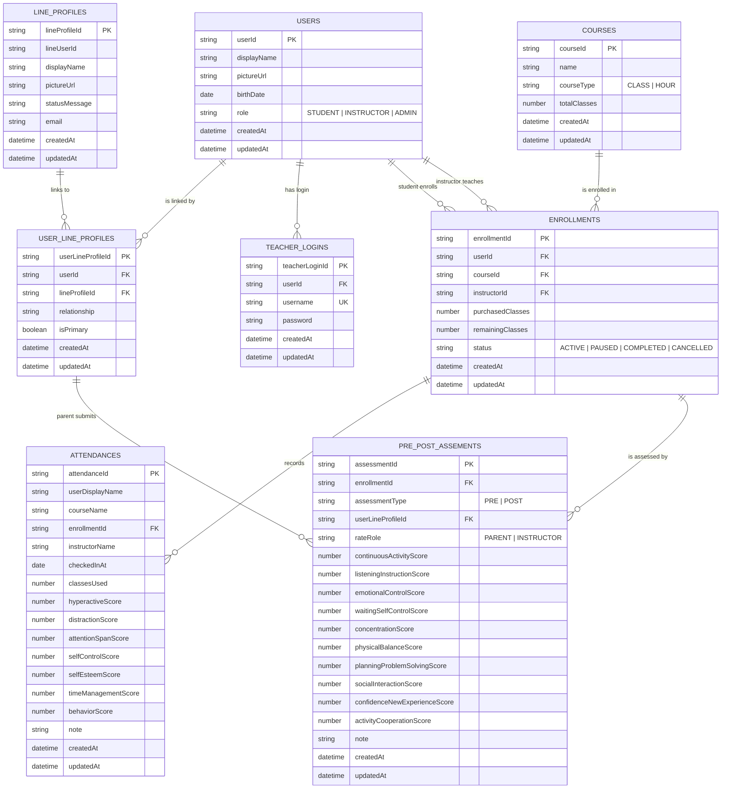

# ER Diagram

โปรเจกต์นี้ใช้ Google Sheets เป็น database โดยแต่ละ sheet ทำหน้าที่เหมือน table
ความสัมพันธ์ด้านล่างอ้างอิงจาก `src/types.ts`, `src/sheets.ts`, service layer และ header ใน `README.md`

## Relationship Notes

- `UserLineProfiles.userId` อ้างถึง `Users.userId`
- `UserLineProfiles.lineProfileId` อ้างถึง `LineProfiles.lineProfileId`
- `TeacherLogins.userId` อ้างถึง `Users.userId` ของผู้ใช้ role `INSTRUCTOR` หรือ `ADMIN`
- `Enrollments.userId` อ้างถึง `Users.userId` ของนักเรียน
- `Enrollments.instructorId` อ้างถึง `Users.userId` ของครู
- `Enrollments.courseId` อ้างถึง `Courses.courseId`
- `Attendances.enrollmentId` อ้างถึง `Enrollments.enrollmentId`
- `PrePostAssessments.enrollmentId` อ้างถึง `Enrollments.enrollmentId`
- `PrePostAssessments.userLineProfileId` อ้างถึง `UserLineProfiles.userLineProfileId` สำหรับผู้ปกครอง
- `PrePostAssessments.assessmentType` ใช้แยกแบบประเมินก่อนเรียน `PRE` และหลังเรียน `POST`
- `PrePostAssessments.rateRole` ใช้แยกผู้ประเมิน `PARENT` และ `INSTRUCTOR`

หมายเหตุ: Google Sheets ไม่ enforce primary key/foreign key เหมือน relational database จริง
แต่แอป enforce บางส่วนใน service layer เช่น unique id และ lookup ด้วย id fields เหล่านี้
